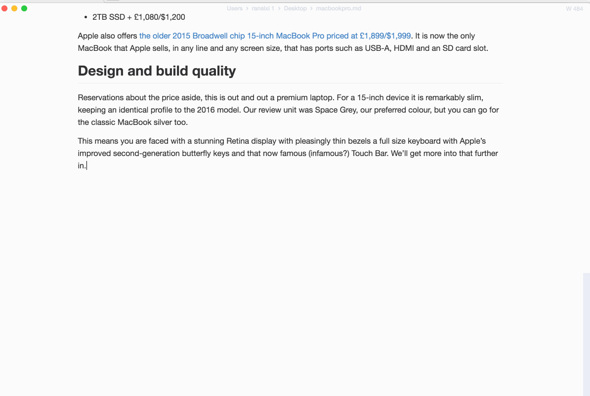
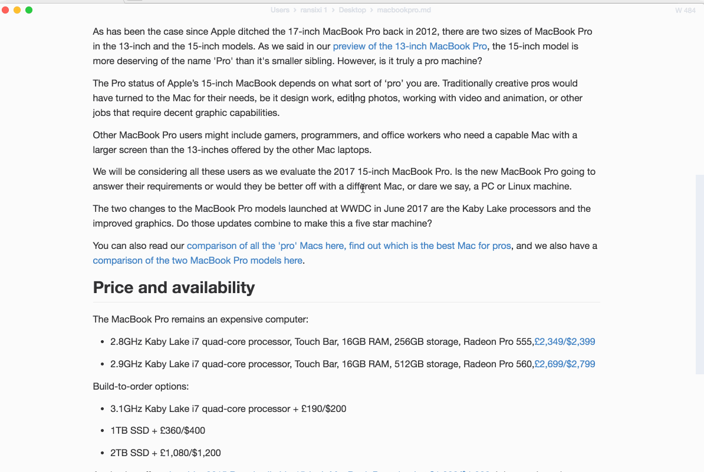

<p align="center"></p>

<h1 align="center">serpdown</h1>

<div align="center">
  <a href="https://twitter.com/intent/tweet?via=serpdownme&url=https://github.com/serpdown/serpdown/&text=What%20do%20you%20want%20to%20say%20to%20app?&hashtags=happyserpdown">
    
  </a>
</div>
<div align="center">
  <strong>:high_brightness: 次世代マークダウンエディタ :crescent_moon:</strong><br>
  シンプルでエレガントなマークダウンエディタ: スピードと使いやすさをあなたに<br>
  <sub>Linux・macOS・Windowsで使用可能</sub>
</div>

<br>

<div align="center">
  <!-- Version -->
  <a href="https://serpdown.github.io/website">
    
  </a>
  <!-- License -->
  <a href="LICENSE">
    
  </a>
  <!-- Build Status -->
  <a href="https://travis-ci.org/serpdown/serpdown/">
    
  </a>
  <a href="https://ci.appveyor.com/project/serpdown/serpdown/branch/master">
    
  </a>
  <!-- Downloads total -->
  <a href="https://github.com/serpdown/serpdown/releases">
    
  </a>
  <!-- Downloads latest release -->
  <a href="https://github.com/serpdown/serpdown/releases/latest">
    
  </a>
  <!-- sponsors -->
  <a href="https://opencollective.com/serpdown">
    
  </a>
</div>

<div align="center">
  <h3>
    <a href="https://github.com/serpdown/serpdown">
      ウェブサイト
    </a>
    <span> | </span>
    <a href="#features">
      特徴
    </a>
    <span> | </span>
    <a href="#download">
      ダウンロード
    </a>
    <span> | </span>
    <a href="#development">
      開発
    </a>
    <span> | </span>
    <a href="#contribution">
      コントリビューション
    </a>
  </h3>
</div>

<div align="center">
  <sub>多言語版:</sub>
  <a href="../../README.md">
    <span>:uk:</span>
  </a>
  <a href="zh_cn.md">
    <span>:cn:</span>
  </a>
  <a href="pl.md">
    <span>:poland:</span>
  </a>
  <a href="french.md">
    <span>:fr:</span>
  </a>
  <a href="tr.md">
    <span>:tr:</span>
  </a>
  <a href="spanish.md">
    <span>:es:</span>
  </a>
  <a href="pt.md">
    <span>:portugal:</span>
  </a>
  <a href="ko.md">
    <span>:kr:</span>
  </a>
</div>

<div align="center">
  <sub>This Markdown editor that could. Built with ❤︎ by
    <a href="https://github.com/Jocs">Jocs</a> and
    <a href="https://github.com/serpdown/serpdown/graphs/contributors">
      contributors
    </a>
  </sub>
</div>

<br />

<h2 align="center">serpdownへの支援</h2>

serpdownは、MITライセンスのオープンソースプロジェクトであり、Githubリリースページからいつでも無料で最新のserpdownをダウンロードできます。serpdownはまだ開発中のソフトウェアであり、開発を続けるためにはスポンサーからのご支援が必要です。どうかserpdownへのご支援をよろしくお願い申し上げます。

- Patreonを介して継続的ご支援をいただける場合は[こちら](https://www.patreon.com/ranluo)から、また、一時寄付金をいただける場合は[こちら](https://github.com/Jocs/sponsor.me)からお願いいたします。
- Open Collectiveを介してご支援をいただける場合は[こちら](https://opencollective.com/serpdown)をご利用ください。

##### PatreonとOpen Collectiveの違い

Patreonを介した寄付は、serpdownの開発および維持を行っているLuo Ran (@jocs)に直接届きます。Open Collectiveを介した寄付は、その額や出資者が公開されます。すべての出資金はserpdownの開発、維持、オンラインおよびオフラインでの活動、そしてその他の必要なリソースの入手に使われます。PatreonかOpen Collectiveかに関わらず、すべての出資者のお名前もしくは会社のロゴは、serpdownの公式サイトおよびReadmeに掲載いたします。

**Platinum Sponsors**

<a href="https://opencollective.com/serpdown#platinum-sponsors">
 
</a>

**Gold Sponsors**

<a href="https://opencollective.com/serpdown#platinum-sponsors">
  
</a>

**Silver Sponsors**

<a href="https://opencollective.com/serpdown#platinum-sponsors">
  
</a>

**Bronze Sponsors**

<a href="https://opencollective.com/serpdown#platinum-sponsors">
  
</a>

**Backers**

<a href="https://opencollective.com/serpdown#backers">
  
</a>

## スクリーンショット


<h2 id="features">特徴</h2>

- WYSIWYGなリアルタイムプレビューと、執筆に没頭できるクリーンでシンプルなインターフェース
- [CommonMark Spec](https://spec.commonmark.org/0.29/)と[GitHub Flavored Markdown Spec](https://github.github.com/gfm/)、および一部の[Pandoc Markdown](https://pandoc.org/MANUAL.html#pandocs-markdown)をサポート
- KaTeXを用いた数式表示、Front matterや絵文字が使用可能
- 段落とインラインショートカットを利用することで編集効率を向上
- **HTML**ファイルと**PDF**ファイルを出力可能
- **Cadmium Light**, **Material Dark**など様々なテーマ
- 選べる編集モード: **Source Code mode**, **Typewriter mode**, **Focus mode**

<h4 align="center">:crescent_moon:テーマ:high_brightness:</h4>

| Cadmium Light                                           | Dark                                                  |
|:-------------------------------------------------------:|:-----------------------------------------------------:|
|   |          |
| Graphite Light                                          | Materal Dark                                          |
|  |  |
| Ulysses Light                                           | One Dark                                              |
|   |      |

<h4 align="center">:smile_cat:編集モード:dog:</h4>

| Source Code                | Typewriter                     | Focus                     |
|:--------------------------:|:------------------------------:|:-------------------------:|
|  |  |  |

## 開発の意図

1. 私は書くことが好きです。これまでに沢山のマークダウンエディタを使ってきましたが、まだ私の要望を完璧に満たすものを見つけられていません。致命的なバグに執筆を邪魔されたくないのです。**serpdown**はページのレンダリングに仮想DOMを用いることで効率を向上させ、さらにオープンソースで提供しました。
2. 上記の通り、**serpdown**はオープンソースなので、誰でもソースコードをコントリビュートすることで開発に参加し、**serpdown** をポピュラーなマークダウンエディタにしていくことができます。
3. 特徴的な機能を備えたマークダウンエディタは既に沢山ありますが、全てのマークダウンユーザーの要望を満たすのは難しいです。まだまだ未熟ですが、**serpdown** がマークダウンユーザーの要望を可能な限り叶えられるエディタになることを願っています。

<h2 id="download">ダウンロード</h2>


|                                                                                                              |                                                                                                                      |                                                                                                                                    |
|:-------------------------------------------------------------------------------------------------------------------------------------------------------------------------------------------------:|:-------------------------------------------------------------------------------------------------------------------------------------------------------------------------------------------------------------:|:-------------------------------------------------------------------------------------------------------------------------------------------------------------------------------------------------------------------------:|
| [](https://github.com/serpdown/serpdown/releases/download/v0.17.1/serpdown-x64.dmg) | [](https://github.com/serpdown/serpdown/releases/download/v0.17.1/serpdown-setup.exe) | [](https://github.com/serpdown/serpdown/releases/download/v0.17.1/serpdown-x86_64.AppImage) |

このバージョンでの新着情報をご確認いただくには、[CHANGELOG](../../.github/CHANGELOG.md)を参照してください。

#### macOS

最新のserpdown(`serpdown-%version%.dmg`)を[リリースページ](https://github.com/serpdown/serpdown/releases/latest)からダウンロードするか、[**homebrew cask**](https://github.com/caskroom/homebrew-cask)を用いてインストールしてください。Homebrew-Caskを使うためには、[Homebrew](https://brew.sh/)がインストールされている必要があります。

```bash
brew install --cask mark-text
```

#### Windows

serpdownをダウンロードして、セットアップウィザード(`serpdown-setup-%version%.exe`)を介してインストールしてください。インストールの際、ユーザごとにインストールするか、グローバルにインストールするかを選択してください。

#### Linux

[Linux installation instructions](../../docs/LINUX.md)を参照してください。

#### その他

Linux、macOSおよびWindows用の全てのバイナリは、[リリースページ](https://github.com/serpdown/serpdown/releases/latest)からダウンロードできます。お使いのシステムで使用可能なソフトウェアがリリースページ内に見つからない場合は、[issue](https://github.com/serpdown/serpdown/issues) を作成してお知らせいただけると幸いです。

<h2 id="development">開発</h2>

**serpdown** を自前でビルドしたい場合は、[build instructions](../../docs/dev/BUILD.md)を参照してください。

- [User documentation](../../docs/README.md)
- [Developer documentation](../../docs/dev/README.md)

**serpdown**に関するご質問がありましたら、フォーマットを参考にissueを作成してください。もちろんプルリクエストを直接提出して頂いても構いません。ご協力ありがとうございます。

## インテグレーション

- [Alfred Workflow](http://www.packal.org/workflow/mark-text): macOS向けのアプリであるAlfred Workflowです。Alfredを起動して、"mt"コマンドを入力することでファイルやフォルダをserpdownで開きます。

<h2 id="contribution">コントリビューション</h2>

serpdownは開発の真っ最中です、プルリクエストを作成する場合は事前に [Contributing Guide](../../CONTRIBUTING.md) をご確認ください。serpdownに追加したい新機能がある場合は、 [roadmap](https://github.com/serpdown/serpdown/projects)を参考にしてissueを作成してください。

## コントリビューター

serpdownにコントリビュートしてくださった [[コントリビューター](https://github.com/serpdown/serpdown/graphs/contributors)] の皆さんに感謝を申し上げます。

serpdownのロゴをデザインしてくださった @[Yasujizr](https://github.com/Yasujizr) に感謝を申し上げます。

<a href="https://github.com/serpdown/serpdown/graphs/contributors"></a>

## ライセンス

[**MIT**](../../LICENSE).

[](https://app.fossa.io/projects/git%2Bgithub.com%2Fserpdown%2Fserpdown?ref=badge_large)
