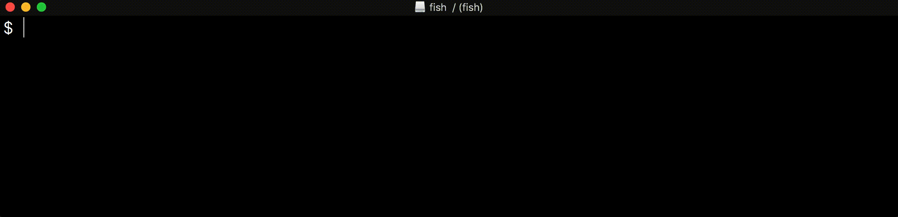

> **This documentation is outdated, based on the original readme from 14 April 2018!**

<h1 align="center">serpdown</h1>

  

  <strong>:high_brightness:Edytor markdown nowej generacji:crescent_moon:</strong>

  Aplikacja na bazie <code>Electron</code> na platformy OS X, Windows i Linux

 

  <!-- Version -->
  
  <!-- License -->
  
  <!-- Build Status -->
  
  <!-- Downloads total -->
  
  <!-- Downloads latest release -->
  
  <!-- deps -->
  
  <!-- donates -->
  

  <h3>
    <a href="https://serpdown.github.io/website">
      Strona
    </a>
     | 
    <a href="https://github.com/serpdown/serpdown#features">
      Cechy programu
    </a>
     | 
    <a href="https://github.com/serpdown/serpdown#download-and-installation">
      Instalacja
    </a>
     | 
    <a href="https://github.com/serpdown/serpdown#development">
      Rozwój
    </a>
     | 
    <a href="https://github.com/serpdown/serpdown#contribution">
      Udział w projekcie
    </a>
  </h3>

  Edytor Markdown, który potrafi. Zbudowany z ❤︎ przez
    <a href="https://github.com/Jocs">Jocs</a> i
    <a href="https://github.com/serpdown/serpdown/graphs/contributors">
      innych
    </a>
  

 

### Cechy programu

- Podgląd na żywo - użycie [snabbdom](https://github.com/snabbdom/snabbdom) jako swojego silnika renderującego.
- Wsparcie specyfikacji [CommonMark](https://spec.commonmark.org/0.29/) i [GitHub Flavored Markdown](https://github.github.com/gfm/).
- Wsparcie paragrafów i skrótów klawiatowych dla stylów wbudowanych w celu zwiększenia twojej wydajności podczas pisania.
- Zapis do plików **HTML** i **PDF**.
- Ciemny i jasny motyw.
- Różne tryby edycji: **Kod źródłowy**, **Maszyna do pisania**, **Skupienie**.

<h4 align="center">:crescent_moon:Motywy:high_brightness:</h4>

| Ciemny :crescent_moon:                                             | Jasny :high_brightness:                                             |
|:------------------------------------------------------------------:|:-------------------------------------------------------------------:|
|  |  |

<h4 align="center">:smile_cat:Tryby edycji:dog:</h4>

| Kod źródłowy                                                         | Maszyna do pisania                                                       | Skupienie                                                           |
|:--------------------------------------------------------------------:|:------------------------------------------------------------------------:|:-------------------------------------------------------------------:|
|  |  |  |

### Dlaczego kolejny edytor?

1. Kocham pisać. Używałem wiele różnych edytorów markdown, ale wciąż nie ma takiego, który byłby w pełni zgodny z moimi oczekiwaniami. Nie lubię, kiedy pisanie przerywają mi niemożliwe do wytrzymania błędy. **serpdown** używa wirtualnego DOM do wyrenderowania strony co sprawia, że jest bardzo wydajny. Program jest rozpowszechniany na licencji open source dla wszystkich przyjaciół kochających markdown i pisanie.
2. Jak już zostało wspomniane powyżej, **serpdown** będzie zawsze rozpowszechniany na licencji open source. Wierzymy, że wszyscy wielbiciele markdown dołożą swoją cegiełkę do kodów źródłowych programu i pomogą w rozwijaniu **serpdown**.
3. Istnieje wiele edytorów markdown i każdy z nich ma swoje cechy szczególne, jednak ciężko jest zaspokoić wszystkie potrzeby użytkowników. Wierzę, że **serpdown** jest w stanie zaspokoić potrzeby jak największej grupy osób. Mimo iż najnowsza wersja **serpdown** nie jest idealna, próbujemy stworzyć go tak doskonałym jak to jest tylko możliwe.

### Instalacja

|                                                                                                              |                                                                                                                      |                                                                                                                                    |
|:-------------------------------------------------------------------------------------------------------------------------------------------------------------------------------------------------:|:-------------------------------------------------------------------------------------------------------------------------------------------------------------------------------------------------------------:|:-------------------------------------------------------------------------------------------------------------------------------------------------------------------------------------------------------------------------:|
|  |  |  |

Nie znalazłeś swojego systemu? Przejdź do strony [release](https://github.com/serpdown/serpdown/releases). Wciąż nie znalazłeś? Zgłoś [problem](https://github.com/serpdown/serpdown/issues).

Chciałbyś zobaczyć jak nowe udogodnienia wprowadziła najnowsza wersja? Udaj się do [CHANGELOG](../../.github/CHANGELOG.md)

Jeśli używasz systemu OS X, to możesz zainstalować serpdown za pomocą [**homebrew cask**](https://github.com/caskroom/homebrew-cask). Aby zacząć korzystać z Homebrew-Cask potrzebujesz tylko [Homebrew](https://brew.sh/).

> brew install --cask mark-text

### Rozwój

Jeżeli chciałbyś samodzielnie zbudować **serpdown**:

- sklonuj to repozytorium.
- uruchom komendę `npm install`
- uruchom komendę `npm run build`
- skopiuj zbudowaną aplikację do folderu Applications lub jeśli używasz systemu Windows uruchom instalator.

W przypadku jakichkolwiek pytań podczas korzystania z **serpdown** zaczęcamy do zgłoszenia problemu. Mamy nadzieję, że będziesz trzymał się ustalonego z góry formatu zgłaszania problemów. Wspaniale by było, jeżeli to właśnie ty naprawisz błąd i zgłosisz pull request.

## Udział w projekcie

serpdown jest w trakcie rozwijania. Upewnij się, że przeczytałeś [Contributing Guide](../../CONTRIBUTING.md) przed stworzeniem pull request. Chcesz dodać nowe udogodnienia do serpdown? Udaj się do [TODO LIST](../../.github/TODOLIST.md)

Dziękujemy wszystkim osobom, które już wzięły udział w projekcie serpdown! Jeżeli już jesteś członkiem [contributors](https://github.com/serpdown/serpdown/graphs/contributors), otwórz pull request aby dodać twoje imię i zdjęcie do poniższej listy osób, które pomogły przy projekcie.

Specjalne podziękowania dla @[Yasujizr](https://github.com/Yasujizr), który zaprojektował logo serpdown.

|  |  |  |  |
|:----------------------------------------------------------------------------------------------:|:----------------------------------------------------------------------------------------------------:|:-----------------------------------------------------------------------------------------------------------:|:-----------------------------------------------------------------------------------------------:|
| [Jocs](https://github.com/Jocs)                                                                | [ywwhack](https://github.com/ywwhack)                                                                | [notAlaanor](https://github.com/notAlaanor)                                                                 | [fxha](https://github.com/fxha)                                                                 |

### Licencja

 [**MIT**](../../LICENSE).

Copyright (c) 2017-present, @Jocs
